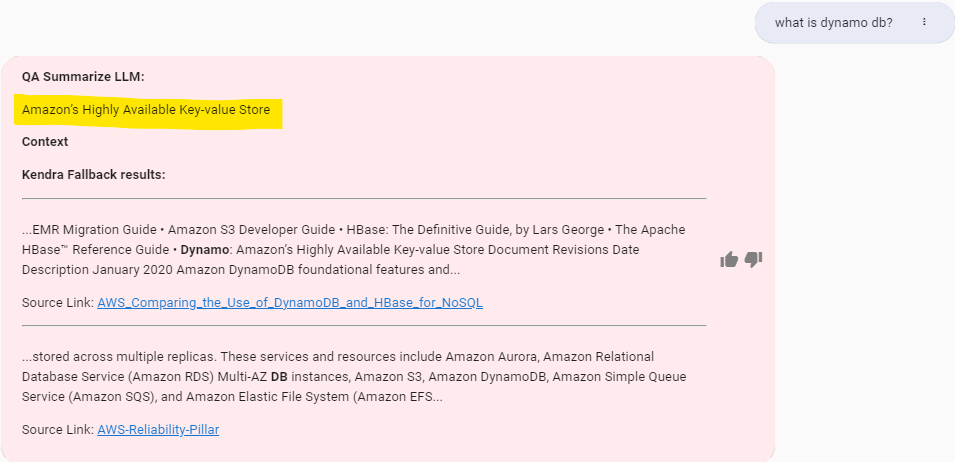
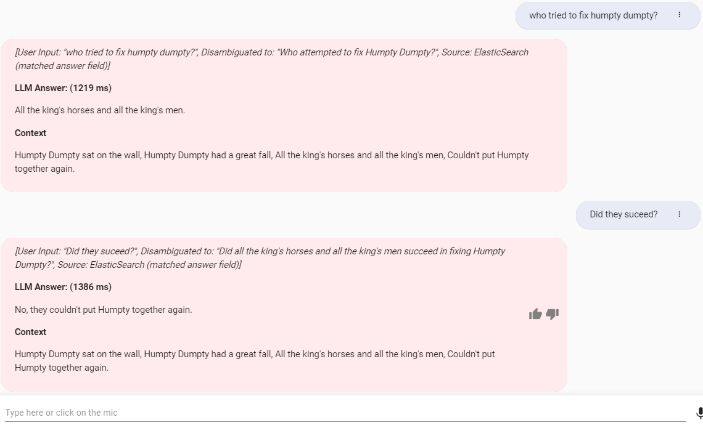
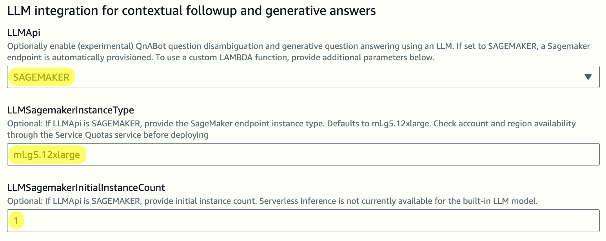
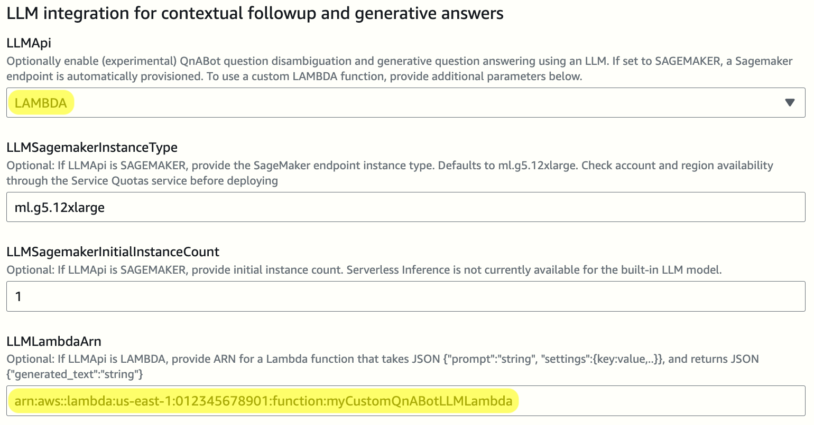

# Large Language Model - Query Disambiguation for Conversational Retrieval, and Generative Question Answering

QnABot can now use a large language model (LLM) to **(1) Disambiguate follow up questions to generate good search queries** and/or **(2) Generate answers to questions from retrieved search results or text passages**.


**(1) Disambiguate follow up questions** that rely on preceding conversation context. The new disambiguated, or standalone, question can then be used as search queries to retrieve the best FAQ, passage or Kendra match.

Example:

With the new LLM Disambiguation feature enabled, given the chat history context:
`[{"Human":"Who was Little Bo Peep?"},{"AI":"She is a character from a nursery rhyme who lost her sheep."}]`
and a follow up question:
`Did she find them again?`
QnABot can rewrite that question to provide all the context required to search for the relevant FAQ or passage:
`Did Little Bo Peep find her sheep again?`.


**(2) Generate answers to questions** from context provided by Kendra search results, or from text passages created or imported directly into QnABot. Some of the benefits include:
- Generated answers allow you to reduce the number of FAQs you need to maintain since you can now synthesize concise answers from your existing documents in a Kendra index, or from document passages stored in QnABot as 'text' items.
- Generated answers can be short, concise, and suitable for voice channel contact center bots as well as website / text bots.
- Generated answers are fully compatible with QnABot's multi-language support - users can interact in their chosen languages and receive generated answers in the same language.

Examples:
With the new LLM QA feature enabled, QnABot can answer questions from the [AWS WhitePapers](https://catalog.us-east-1.prod.workshops.aws/workshops/df64824d-abbe-4b0d-8b31-8752bceabade/en-US/200-ingesting-documents/230-using-the-s3-connector/231-ingesting-documents) such as:
- *"What is Dynamo DB?"* -> **Amazon’s Highly Available Key-value Store**

  

- *"What frameworks does AWS have to help people design good architectures?"* -> **Well-Architected Framework**

It can even generate answers to yes/no questions, like:
- *"Is Lambda a database service?"* -> **No, Lambda is not a database service.**.

If you aren't using AWS Kendra, QnABot can answer questions based on passages created or imported into Content Designer, such as:
- *"Where did Humpty Dumpty sit?"* -> **On the wall**,
- *"Did Humpty Dumpty sit on the wall?"* -> **yes**,
- *"Were the king's horses able to fix Humpty Dumpty?"* -> **No**

all from a text passage item that contains the nursery rhyme.


You can use disambiguation and generative question answering, as shown below:


**This is an Experimental feature, for now**
- We encourage you to try it on non-production instances to validate accuracy and business value.
- Try different LLM models and APIs
- Experiment with different LLM prompts (easily adjusted using QnABot Settings - discussed below)
- Run throughput testing and inference endpoint scale testing to properly estimate deployment size/costs.. NOTE we do not yet have any scale/costing guidelines, so please share your findings.


With this release, you can choose which LLM to use with QnABot:
1. An open source LLM model automatically deployed and hosted on an Amazon SageMaker endpoint - see https://huggingface.co/tiiuae/falcon-40b-instruct
2. Any other LLM model or API you like via a user provided Lambda function.

### 1. Amazon SAGEMAKER

QnABot provisions a Sagemaker endpoint running the Hugging Face [tiiuae/falcon-40b-instruct](https://huggingface.co/tiiuae/falcon-40b-instruct) model

By default a 1-node ml.g5.12xlarge endpoint is automatically provisioned. For large volume deployments, add additional nodes by setting the parameter `LLMSagemakerInitialInstanceCount`. Please check [SageMaker pricing documentation](https://aws.amazon.com/sagemaker/pricing/) for relevant costs and information on Free Tier eligibility.

#### Deploy Stack for SAGEMAKER

- *(for Kendra Fallback)* set `DefaultKendraIndexId` to the Index Id (a GUID) of your existing Kendra index containing ingested documents
- *(for text passage queries)* set `EmbeddingsApi` to SAGEMAKER or LAMBDA (see  [Semantic Search using Text Embeddings](../semantic_matching_using_LLM_embeddings/README.md))
- set `LLMApi` to SAGEMAKER



### 2. Lambda function

Use a custom Lambda function to experiment with LLMs of your choice. Provide your own lambda function that takes a *question*, *context*, and a QnABot *settings* object. Your Lambda function can invoke any LLM you choose, and return the prediction in a JSON object containing the key, `generated_text`. You provide the ARN for your Lambda function when you deploy or update QnABot.

*See [QnABot on AWS Sample Plugins](https://github.com/aws-samples/qnabot-on-aws-plugin-samples/blob/develop/README.md) for some sample customizable plugins to integrate QnABot with your choice of leading LLM providers including our own Amazon Bedrock service (in preview), Anthropic, and AI21. Note that the plugin project is listed here for reference only and is a separate project from the QnABot project.*

#### Deploy Stack for Embedding models invoked by a custom Lambda Function

- *(for Kendra Fallback)* set `DefaultKendraIndexId` to the Index Id (a GUID) of your existing Kendra index containing ingested documents
- *(for text passage queries)* set `EmbeddingsApi` to SAGEMAKER or LAMBDA (see  [Semantic Search using Text Embeddings](../semantic_matching_using_LLM_embeddings/README.md))
- set `LLMApi` to LAMBDA
- set `LLMLambdaArn` to the ARN of your Lambda function



Your Lambda function is passed an event of the form:
```
{
  "prompt": "string", // prompt for the LLM
  "parameters":{"temperature":0,...}, // model parameters object containing key / value pairs for the model parameters setting (defined in QnABot settings - see below)
  "settings":{"key1":"value1",...} // settings object containing all default and custom QnABot settings
}
```
and returns a JSON structure of the form:
```
{"generated_text":"string"}
```

Here's an example of a minimal Lambda function for testing. Of course you need to extend it to actually invoke your LLM!
```
def lambda_handler(event, context):
    print(event)
    prompt = event["prompt"]
    model_params = event["parameters"]
    settings = event["settings"]
    generated_text = f"This is the prompt: {prompt}" # REPLACE WITH LLM INFERENCE API CALL
    return {
        'generated_text': generated_text
    }
```


### Relevant Settings

When QnABot stack is installed, open Content Designer **Settings** page:

- **ENABLE_DEBUG_RESPONSES** set to true to add additional debug information to the QnABot response, including any language translations (if using multi language mode), question disambiguation (before and after), and inference times for your LLM model(s).

- **ES_SCORE_TEXT_ITEM_PASSAGES:** should be "true" to enable the new QnABot text passage items to be retrieved and used as input context for generative QA Summary answers. NOTE - 'qna' items are queried first, and in none meet the score threshold, then QnABot queries the text field of 'text' items

- **EMBEDDINGS_TEXT_PASSAGE_SCORE_THRESHOLD:** applies only when Embeddings are enabled (recommended) and if ES_SCORE_TEXT_ITEM_PASSAGES is true. If embedding similarity score on text item field is under threshold the match is rejected. Default is 0.80.

- **ALT_SEARCH_KENDRA_INDEXES:**  be set to the Id (not the name) of your Kendra index where you have ingested documents of web pages that you want to use as source passages for generative answers. If you plan to use only QnABot text passage items instead of Kendra, leave this setting blank.

- **ALT_SEARCH_KENDRA_MAX_DOCUMENT_COUNT:** the number of passages from Kendra to provide in the input context for the LLM.

*Scroll to the bottom of the settings page and observe the new LLM settings:*

- **LLM_API:** one of SAGEMAKER, LAMBDA - based on the value chosen when you last deployed or updated the QnABot Stack.
- **LLM_GENERATE_QUERY_ENABLE:** set to true or false to enable or disable question disambiguation.
- **LLM_GENERATE_QUERY_PROMPT_TEMPLATE:** the prompt template used to construct a prompt for the LLM to disambiguate a followup question. The template may use the placeholders:
  - `{history}` - placeholder for the last `LLM_CHAT_HISTORY_MAX_MESSAGES` messages in the conversational history, to provide conversational context.
  - `{input}` - placeholder for the current user utterance / question
- **LLM_GENERATE_QUERY_MODEL_PARAMS:** parameters sent to the LLM model when disambiguating follow-up questions. Default: `{"temperature":0}`. Check model documentation for additional values that your model provider accepts.
- **LLM_QA_ENABLE:** set to true or false to enable or disable generative answers from passages retrieved via embeddings or Kendra fallback (when no FAQ match its found). NOTE LLM based generative answers are not applied when an FAQ / QID matches the question.
- **LLM_QA_USE_KENDRA_RETRIEVAL_API:** set to true or false to enable or disable the use of Kendra's retrieval API. When enabled, QnABot uses Kendra's Retrieve api to retrieve semantically relevant passages of up to 200 token words from the documents in your index (not FAQs). When disabled, QnABot use the default Kendra Query API to search documents and FAQs. Takes effect only when LLM_QA_ENABLE is true. The default is true (recommended) when LLM QA is enabled. Note: this feature will only search the first configured index. See https://docs.aws.amazon.com/kendra/latest/APIReference/API_Retrieve.html
- **LLM_QA_PROMPT_TEMPLATE:**  the prompt template used to construct a prompt for the LLM to generate an answer from the context of a retrieved passages (from Kendra or Embeddings). The template may use the placeholders:
  - `{context}` - placeholder for passages retrieved from the search query - either a QnABot 'Text' item passage, or the Top `ALT_SEARCH_KENDRA_MAX_DOCUMENT_COUNT` Kendra passages
  - `{history}` - placeholder for the last `LLM_CHAT_HISTORY_MAX_MESSAGES` messages in the conversational history, to provide conversational context.
  - `{input}` - placeholder for the current user utterance / question
  - `{query}` - placeholder for the generated (disambiguated) query created by the generate query feature. NOTE the default prompt does not use `query` in the qa prompt, as it provides the conversation history and current user input instead, but you can change the prompt to use `query` instead of, or in addition to `input` and `history` to tune the LLM answers.
- **LLM_QA_NO_HITS_REGEX:** when the pattern specified matches the response from the LLM, e.g. `Sorry, I don't know`, then the response is treated as no_hits, and the default `EMPTYMESSAGE` or Custom Don't Know ('no_hits') item is returned instead. Disabled by default, since enabling it prevents easy debugging of LLM don't know responses.
- **LLM_QA_MODEL_PARAMS:** parameters sent to the LLM model when generating answers to questions. Default: `{"temperature":0}`. Check model documentation for additional values that your model provider accepts.
- **LLM_QA_PREFIX_MESSAGE:** Message use to prefix LLM generated answer. May be be empty.
- **LLM_QA_SHOW_CONTEXT_TEXT:** set to true or false to enable or disable inclusion of the passages (from Kendra or Embeddings) used as context for LLM generated answers.
- **LLM_QA_SHOW_SOURCE_LINKS:** set to true or false to enable or disable Kendra Source Links or passage refMarkdown links (doc references) in markdown answers.
- **LLM_CHAT_HISTORY_MAX_MESSAGES:** the number of previous questions and answers (chat history) to maintain (in the QnABot DynamoDB UserTable). Chat History is necessary for QnABot to disambiguate follow up questions from previous question and answer context.
- **LLM_PROMPT_MAX_TOKEN_LIMIT:** the maximum number of tokens that can be sent to the LLM. QnABot will selectively truncate the prompt by chat history (first) and context (second) to shorten the prompt length. **NOTE:** The tokenizer uses gt2 encoding to estimate the token count and is only an approximation. The value for this setting should be set lower than the max number of tokens supported by the LLM model and may require calibration.


## Try it!

**With Kendra**

Use it with your Kendra index to ask questions that can be answered from web pages that you've crawled or documents that you've ingested using a Kendra data source connector. If you're not sure how to load documents into Kendra, see the Kendra Essentials Workshop: [Ingesting AWS WhitePapers into a Kendra index](https://catalog.us-east-1.prod.workshops.aws/workshops/df64824d-abbe-4b0d-8b31-8752bceabade/en-US/200-ingesting-documents/230-using-the-s3-connector/231-ingesting-documents)


**With the new Text item type**

Use the new **QnABot Text item** to directly create your own passages of text in QnABot's embedded OpenSearch store.
In Content Designer, choose **Add**, select **text**, enter an Item ID and a Passage, and choose **Create**.


QnABot saves your passage, along with the text embeddings; for best results when using native passage retrieval in QnABot, be sure to enable [Semantic Search using Text Embeddings](../semantic_matching_using_LLM_embeddings/README.md).

Test your queries match the desired text item using the TEST tab in Content Designer. To test matches for text item passages, select the appropriate drop down before choosing SEARCH. Compare scores on "qna questions" to the configured threshold setting `EMBEDDINGS_SCORE_THRESHOLD` and for passages to the threshold setting `EMBEDDINGS_TEXT_PASSAGE_SCORE_THRESHOLD`. You may need to adjust thresholds to get the desired behavior when using the bot with the web client.

You can also import your passages from a JSON file using Content Designer import. From the Tools menu on the top left, choose **Import**, open **Examples/Extensions** and choose the LOAD button next to **TextPassage-NurseryRhymeExamples** to import two nursery rhyme text items.
To import your own passages create and import a JSON file with the structure similar to below:
```
{
  "qna": [
    {
      "passage": "Humpty Dumpty sat on the wall,\nHumpty Dumpty had a great fall,\nAll the king's horses and all the king's men,\nCouldn't put Humpty together again.",
      "type": "text",
      "qid": "0.HumptyDumpty"
    }
  ]
}
```

