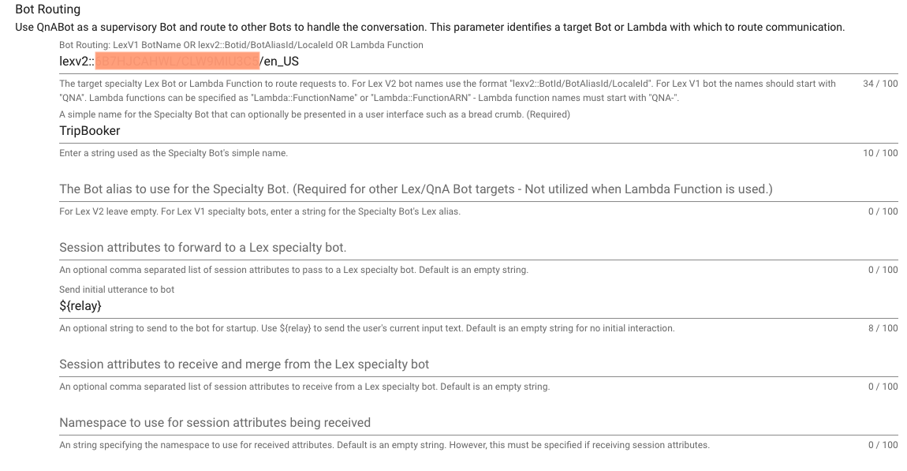

# Bot Routing 
(version 1.2 - November 2022)

Bots exist to perform a variety of automation tasks. Usually they take
as input a message from a human and respond performing
some task. Bots might ask for additional input, verify the input, 
and respond with completion. They come in many shapes and sizes. Bots might be implemented
using Amazon Lex or might be implemented using other toolsets. A great
example is the [Nutritionix bot](https://www.nutritionix.com/natural-demo?q=for%20breakfast%20i%20ate%203%20eggs,%20bacon%20and%20cheese)
where you can tell the bot what you've had for breakfast and it will
respond with nutrition information.

With so many bots coming into existence, how can an enterprise
maximize the value across an organization?

#### QnABot routing

The solution adopted by QnABot is to coordinate (route) bot requests
to the appropriate Bot based on questions or tasks the bot can answer.
The Bot performing the routing is known as a supervisory Bot.

Content designers associate questions or tasks (qid's) that identify a BotRouter
to target for the question. This is performed using the QnABot
UI Designer. Once configured, if a user asks a question or directs the bot
with some instruction, QnABot responds with an answer and sets up a channel to
communicate with the specialty Bot. From that point forward messages / responses
from the user are delivered to the specialty Bot. Specialty Bots respond to actions
and QnABot delivers the answers.

This flow continues until one of several events occur.

1) The user cancels the conversation with the specialty Bot
by uttering "exit", "quit", "bye", or a configurable phrase defined in the settings
configuration of QnABot.
2) The specialty BotRouter (custom code) responds with a message
indicating the conversation should discontinue. (QNABOT_END_ROUTING)
3) The specialty Bot is a LexBot (non QnABot) that indicates fulfillment
is complete.
4) If the target Bot is another QnABot, session attributes can be set by the
specialty QnABot set indicating the conversation should discontinue. (QNABOT_END_ROUTING)

Specialty Bots can be developed for specific parts of an organization like IT,
or Finance, or Project Management, or Documentation. A supervisory Bot at an
enterprise level can direct users to answers from any of their Bots.

#### Configuration

Configuration is simple. Each question in QnABot now contains an optional section which
allows configuration of a BotRouter.

**Note: This is optional. Please leave empty and QnABot will not act as a
BotRouter for the question being edited.**



* Bot Name or Lambda - You can configure and existing Lex Bot or configure
a specialty BotRouter implemented via a Lambda function. QnABot route 
requests to a Lex Version 1 or Version 2 bot. The syntax is different
depending on the target version. For Lex version 2 bots use the syntax
lexv2::BotId/BotAliasId/LocaleId. For Lex version 1 bots use just the 
BotName. Note that QnABot can be installed as either Lex V1 or Lex V2
bot. It is important to check your QnABot configuration and select the
appropriate identifiers when you want to use QnABot as a specialty bot.
  
* Simple name - A short string that we expect web User Interfaces to use as
a breadcrumb to identify where in an enterprise the user is interacting.
  
* Lex Alias - If your specialty bot is a Lex version 1 bot, specify the Lex version 1
alias used to communicate with the target bot.

* Lex session attributes to forward to the specialty bot. A comma separated
list of session attribute names can be specified. The session attributes
will be passed on each request to the specialty bot. They will override
any session attributes which might have been returned from the specialty bot
on the prior request. 

* The initial utterance to send to the target bot. You can specify this as ${relay} in which
case QnABot will send the input utterance matching this qid to the target bot or specify
a different string to send on startup. Leave this field blank to not send an utterance 
to the specialty bot on startup. 

* Lex session attributes to return from the specialty bot. A comma separated list
of session attribute names can be specified that will be returned on each interaction
with the specialty bot.

* If Lex session attributes are being returned from the specialty bot, a namespace with
which to scope the returned attributes must be specified. 

*Note: when integrating with other Lex Bots or Lambdas, the permission to 
communicate with the target Lex bot or with a new BotRouter (Lambda) need to
be added to the QnABot's fulfillment lambda role.*

#### Message Protocol for a new Bot Router implemented in Lambda
The input json payload to the target Lambda will be the following:
```
    req: {
        request: "message",
        inputText: <String>,
        sessionAttributes: <Object>),
        userId: <String>
    }
```
The expected response payload from the target lambda is the following:
```
{   response: "message", 
	status: "success", "failed"
	message: <String>,
	messageFormat:  "PlainText", "CustomPayload", "SSML", "Composite"
	sessionAttributes: Object,
	sessionAttributes.appContext.altMessages.ssml: <String>,
	sessionAttributes.appContext.altMessages.markdown: <String>,
	sessionAttributes.QNABOT_END_ROUTING: <AnyValue>
	responseCard: <standard Lex Response Card Object>
}
```

#### Sample Bot Router 
The Nutritionix nodejs based sample BotRouter is provided in the github repo
as a zip file at
[sample bot router](./docs/nutritionix_botrouter.zip). To use this sample
you'll need to provision an  [API account with Nutritionix](https://www.nutritionix.com/business/api) and configure the 
source to use your own x-app-id and x-app-key from Nutritionix. 
```
    'x-app-id': process.env.xAppId,
    'x-app-key': process.env.xAppKey
```
Next build and deploy the code into Lambda using your favorite techniques and grant
permission within the QnABot Fulfillment Lambda Role using IAM to invoke this Lambda. 
Hint: If you name the lambda starting with 'qna', QnABot is already configured with permissions 
to invoke this Lambda. 

